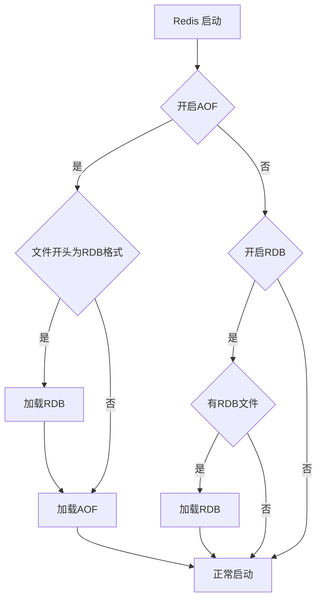

# Redis 原理
## 持久化
**混合持久化**

```mermaid
graph TD
    A[Redis 启动] --> B{开启AOF}
    B -- 是 --> C{文件开头为RDB格式}
    C -- 是 --> D[加载RDB]
    D --> E[加载AOF]
    E --> F[正常启动]
    C -- 否 --> E
    B -- 否 --> G{开启RDB}
    G -- 是 --> H{有RDB文件}
    H -- 是 --> I[加载RDB]
    I --> F
    H -- 否 --> F
    G -- 否 --> F
```