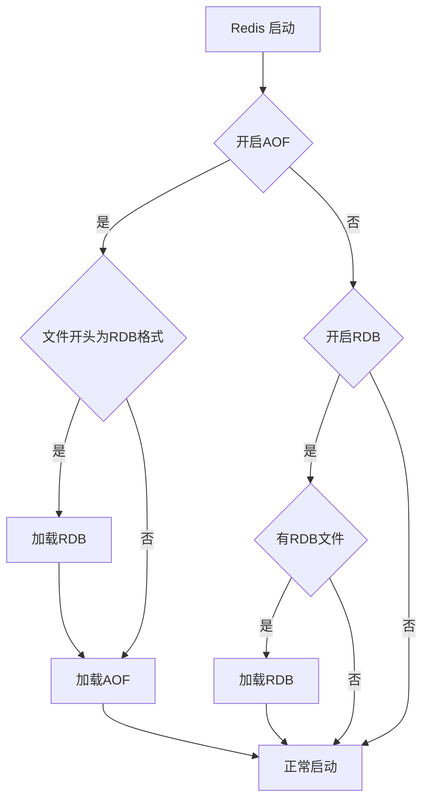

# Redis 原理
## 持久化

Redis 持久化拥有以下三种方式：

- **快照方式**（RDB, Redis DataBase）将某一个时刻的内存数据，以二进制的方式写入磁盘；
- **文件追加方式**（AOF, Append Only File），记录所有的操作命令，并以文本的形式追加到文件中；
- **混合持久化方式**，Redis 4.0 之后新增的方式，混合持久化是结合了 RDB 和 AOF 的优点，在写入的时候，先把当前的数据以 RDB 的形式写入文件的开头，再将后续的操作命令以 AOF 的格式存入文件，这样既能保证 Redis 重启时的速度，又能减低数据丢失的风险。

### RDB

**RDB 优点**

- RDB 的内容为二进制的数据，占用内存更小，更紧凑，更适合做为备份文件；
- RDB 对灾难恢复非常有用，它是一个紧凑的文件，可以更快的传输到远程服务器进行 Redis 服务恢复；
- RDB 可以更大程度的提高 Redis 的运行速度，因为每次持久化时 Redis 主进程都会 fork() 一个子进程，进行数据持久化到磁盘，Redis 主进程并不会执行磁盘 I/O 等操作；
- 与 AOF 格式的文件相比，RDB 文件可以更快的重启。

**RDB 缺点**

- 因为 RDB 只能保存某个时间间隔的数据，如果中途 Redis 服务被意外终止了，则会丢失一段时间内的 Redis 数据；
- RDB 需要经常 fork() 才能使用子进程将其持久化在磁盘上。如果数据集很大，fork() 可能很耗时，并且如果数据集很大且 CPU 性能不佳，则可能导致 Redis 停止为客户端服务几毫秒甚至一秒钟。

### AOF

**AOF 优点**

- AOF 持久化保存的数据更加完整，AOF 提供了三种保存策略：每次操作保存、每秒钟保存一次、跟随系统的持久化策略保存，其中每秒保存一次，从数据的安全性和性能两方面考虑是一个不错的选择，也是 AOF 默认的策略，即使发生了意外情况，最多只会丢失 1s 钟的数据；
- AOF 采用的是命令追加的写入方式，所以不会出现文件损坏的问题，即使由于某些意外原因，导致了最后操作的持久化数据写入了一半，也可以通过 redis-check-aof 工具轻松的修复；
- AOF 持久化文件，非常容易理解和解析，它是把所有 Redis 键值操作命令，以文件的方式存入了磁盘。即使不小心使用 `flushall` 命令删除了所有键值信息，只要使用 AOF 文件，删除最后的 `flushall` 命令，重启 Redis 即可恢复之前误删的数据。

**AOF 缺点**

- 对于相同的数据集来说，AOF 文件要大于 RDB 文件；
- 在 Redis 负载比较高的情况下，RDB 比 AOF 性能更好；
- RDB 使用快照的形式来持久化整个 Redis 数据，而 AOF 只是将每次执行的命令追加到 AOF 文件中，因此从理论上说，RDB 比 AOF 更健壮。

### 混合

**混合持久化优点：**

- 混合持久化结合了 RDB 和 AOF 持久化的优点，开头为 RDB 的格式，使得 Redis 可以更快的启动，同时结合 AOF 的优点，有减低了大量数据丢失的风险。

**混合持久化缺点：**

- AOF 文件中添加了 RDB 格式的内容，使得 AOF 文件的可读性变得很差；
- 兼容性差，如果开启混合持久化，那么此混合持久化 AOF 文件，就不能用在 Redis 4.0 之前版本了。

## 数据类型

